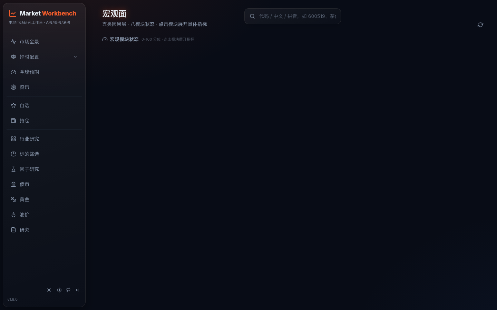
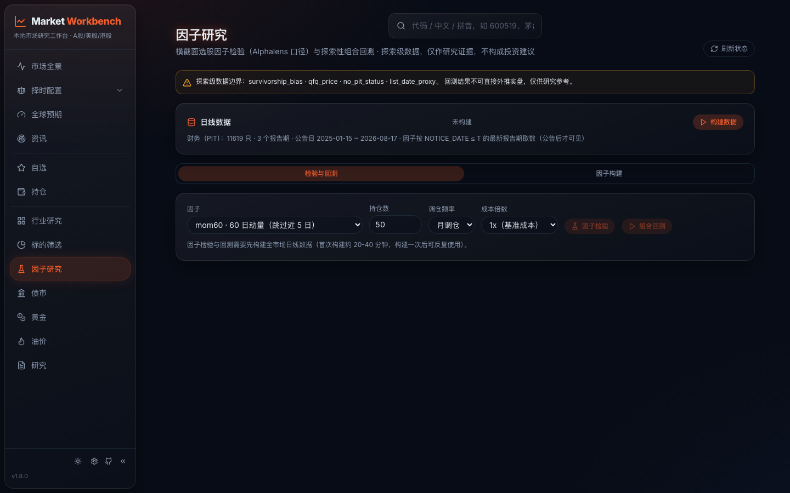
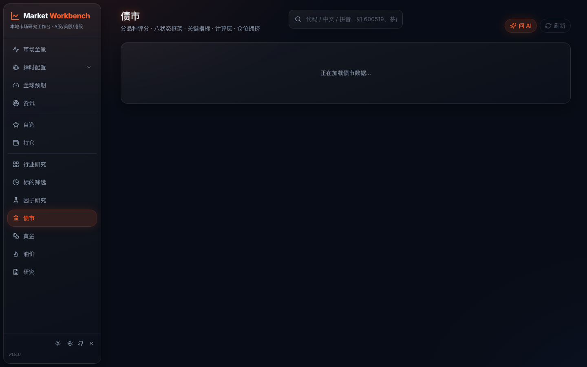
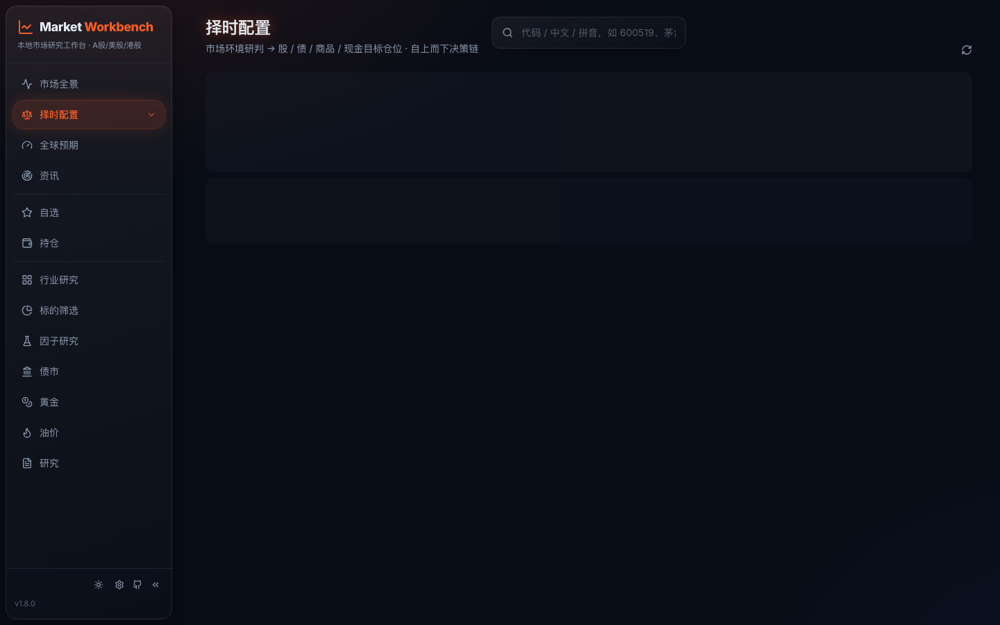
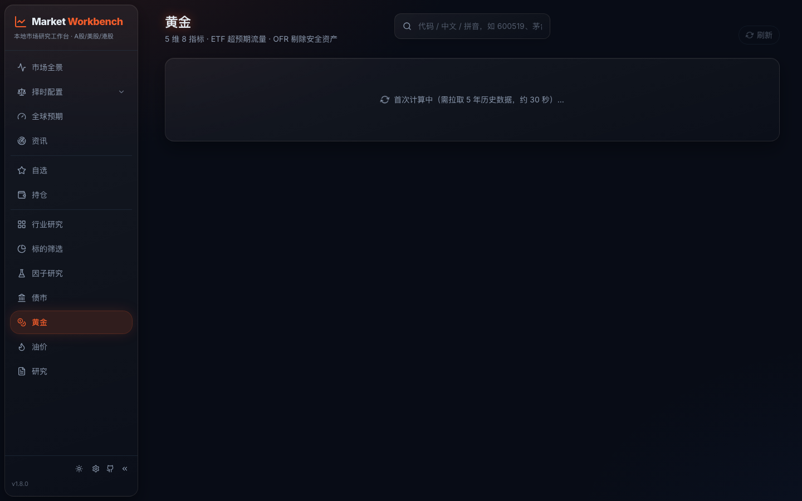
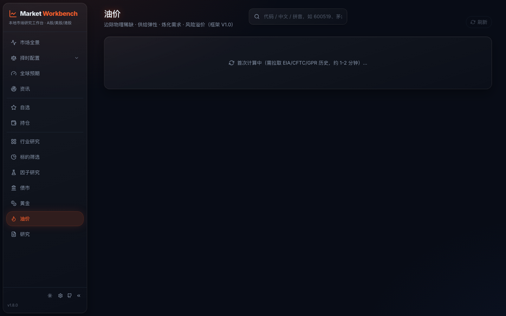

<p align="center"><a href="README.md">简体中文</a> | <b>English</b></p>

# Market Workbench

[](CHANGELOG.md)
[](https://www.python.org/)
[](https://react.dev/)
[](LICENSE)

A locally hosted research workbench for China A-shares, with Hong Kong and US coverage. Quotes, financials, fund flows, macro, sectors, bonds, gold, oil, factor evaluation and public news in one interface. Data stays on your machine; you bring the AI connection; the project issues no stock picks or trading instructions.

**Why this project**

- **Fully local** — FastAPI + React; accounts, portfolios and reports live in `~/.vibe-research/` on your machine. No cloud hosting, no telemetry.
- **Zero-key data** — Public endpoints: Eastmoney, Tencent, Sina, AkShare, FRED, EIA, IMF, Polymarket/Kalshi. Almost none require an API key. Core dependencies are lightweight; heavy data sources are optional (missing ones return 501 with install hints, other features keep working).
- **BYO AI** — Plug in your own OpenAI-compatible API or local CLI (Claude Code / Codex / Qwen / Gemini / DeepSeek). Keys are stored only in your browser.
- **Agent-ready** — Ships an MCP server with zero third-party dependencies, exposing 41 data tools to local agents (quotes, valuation, financials, flows, macro/liquidity composites, industry chains, bonds, factor backtests, and more).
- **Honest research boundaries** — Every indicator shows its source and freshness. No stock recommendations, price targets, or timing calls.

> Market Workbench is a derivative of [simonlin1212/Vibe-Research](https://github.com/simonlin1212/Vibe-Research), retaining its public-data and pluggable-AI foundations, and adding macro and liquidity views, bonds/gold/oil pages, timing & allocation, factor research, industry chains, fund workflows, account-scoped sync, and visible data-source freshness.


<details>
<summary>More screenshots</summary>

| Macro | Factor lab |
|---|---|
|  |  |

| Bonds | Timing & Allocation |
|---|---|
|  |  |

| Gold | Oil |
|---|---|
|  |  |

</details>

## Contents

- [Feature overview](#feature-overview)
- [Architecture](#architecture)
- [Quick start](#quick-start)
- [Connecting AI and agents](#connecting-ai-and-agents)
- [Configuration and data](#configuration-and-data)
- [Development](#development)
- [Documentation](#documentation)
- [Scope and disclaimer](#scope-and-disclaimer)

## Feature overview

| Module | What it covers |
|---|---|
| Market overview | A-share indices, global markets, sentiment, turnover, sector flows, daily review |
| Global expectations | Polymarket and Kalshi public probabilities with sources, refresh times, history and AI insight cards |
| Macro | Macro indicators, module scores, and a composite score card (backtested weights) with source and freshness |
| Liquidity | CN/US liquidity composite scores, liquidity signals, market-flow indicators |
| Timing & Allocation | Macro × liquidity × market-confirm timing score (5 risk levels, risk-budget multiplier, cash floor) mapped to equity/bond/commodity/cash target weights |
| Securities | A-share, HK and US quotes; charts, valuation, financials, filings, reports, fund flows |
| Watchlist / Portfolio | Grouped stock and ETF watchlists; equity and fund holdings, closed positions, return tracking |
| Industry research | Industry-chain depth (stage maps, profit distribution, bottleneck transmission), Shenwan industry and thematic-board scores |
| Bonds | Yield curve, term/credit spreads, Shibor, LPR, CN-US spread, eight-state framework, segment scores |
| Gold / Oil | Gold multi-factor scoring with PAXG-to-CNY conversion; oil 5-dimension 8-indicator scoring (EIA/CFTC/GPR) and crack-spread proxy |
| Screening | Manager-First fund screening; natural-language stock screening (AI verifies each condition; no built-in candidate pool) |
| Factor lab | Price-volume factor evaluation (RankIC / quintile returns / turnover, Alphalens-style), formula-engine custom factors (25 price-volume + PIT financial fields, announcement-date aligned) and exploratory long-only backtests |
| News / Research | Public-news aggregation and announcement tracking; personal report archive, notes and reflection review |

## Architecture

```text
Browser ──/api──► React + Vite (5899) ──► FastAPI (8900) ──┬─ Public market data (quotes/financials/macro/news)
                                                            ├─ ~/.vibe-research/ (accounts SQLite, portfolios, reports)
                                                            └─ AI: user-configured API or local CLI
```

- **Frontend**: React 19, TypeScript, Vite, Tailwind, ECharts
- **Backend**: FastAPI, SQLite (users/sessions), 30+ topic-split data modules under `backend/`
- **MCP server**: pure-stdlib JSON-RPC over stdio, sharing the same data-tool layer as the HTTP API

See [docs/architecture.md](docs/architecture.md).

## Quick start

Requirements: Python 3.10+, Node.js 20+.

```bash
git clone https://github.com/FLIER001/Market-Workbench.git
cd Market-Workbench
```

```bash
# Terminal 1: backend (http://127.0.0.1:8900)
cd backend
python3 -m venv .venv
.venv/bin/pip install -r requirements.txt
.venv/bin/python -m uvicorn app:app --host 127.0.0.1 --port 8900
```

```bash
# Terminal 2: frontend (http://127.0.0.1:5899)
cd frontend
npm install
npm run dev
```

Open <http://127.0.0.1:5899>. On first launch (empty user database) you can register the primary account from the web page; registration then closes by default and accounts are managed via a CLI:

```bash
cd backend && .venv/bin/python add_user.py add <username>   # also list / passwd / remove
```

Verify with `curl -fsS http://127.0.0.1:8900/api/health`. For common issues (backend unreachable, missing data, data location after upgrades) see [docs/getting-started.md](docs/getting-started.md).

## Connecting AI and agents

1. **Web UI** — In Settings, choose a local CLI or enter an OpenAI-compatible API endpoint, model and key. The configuration is stored only in your browser and submitted to your backend only when a model call is made.
2. **Agents** — Register the MCP server (same version and data layer as the HTTP API; no key needed locally):

```bash
cd backend
claude mcp add market-workbench -- "$(pwd)/.venv/bin/python" "$(pwd)/mcp_server.py"
```

See [backend/README.md](backend/README.md) for API groups and the full MCP tool list.

## Configuration and data

Local development needs no configuration: the frontend proxies `/api` to `http://127.0.0.1:8900` by default. For internet-facing deployments set the security variables:

| Variable | Default | Purpose |
|---|---|---|
| `VR_ALLOW_ORIGINS` | `*` | CORS allowlist; tighten to your frontend domain when public |
| `VR_API_KEY` | empty | When set, all `/api/*` (except health) require Bearer auth |
| `VR_ALLOW_REGISTRATION` | off | Set to 1 to reopen web registration |
| `VR_DATA_DIR` / `VR_REPORTS_DIR` | `~/.vibe-research/` | Where accounts/portfolios/reports are stored |
| `VR_DATA_PROXY` | off | Set to 1 only if the machine must use a system proxy to reach data sources |

Full variable list (incl. `VR_EIA_API_KEY`, deep-analysis model overrides) in [docs/configuration.md](docs/configuration.md); examples in [backend/.env.example](backend/.env.example).

## Development

```bash
# Backend tests (pytest)
cd backend && .venv/bin/python -m pytest tests -q

# Frontend tests and build (node --test / tsc + vite)
cd frontend && npm test && npm run build
```

`frontend/package.json` is the single source of truth for the version; the HTTP API, MCP server and UI all read from it. Releases in [CHANGELOG.md](CHANGELOG.md); plans in [ROADMAP.md](ROADMAP.md).

## Documentation

| Doc | Contents |
|---|---|
| [docs/getting-started.md](docs/getting-started.md) | Local setup, verification, common issues |
| [docs/configuration.md](docs/configuration.md) | Environment variables, data paths, public deployment |
| [docs/architecture.md](docs/architecture.md) | Frontend/backend structure, data sources, AI interfaces |
| [backend/README.md](backend/README.md) | HTTP API groups and MCP tool list |
| [CHANGELOG.md](CHANGELOG.md) · [ROADMAP.md](ROADMAP.md) | Release history and roadmap |

## Scope and disclaimer

Market Workbench organizes public data and information you enter yourself. Indicators, rankings and AI output are research references, not investment advice; the project does not recommend securities, forecast prices, time trades or promise returns. Data comes from public endpoints that may be delayed, missing or rate-limited; verify sources and decide independently.

## License

[MIT](LICENSE)
