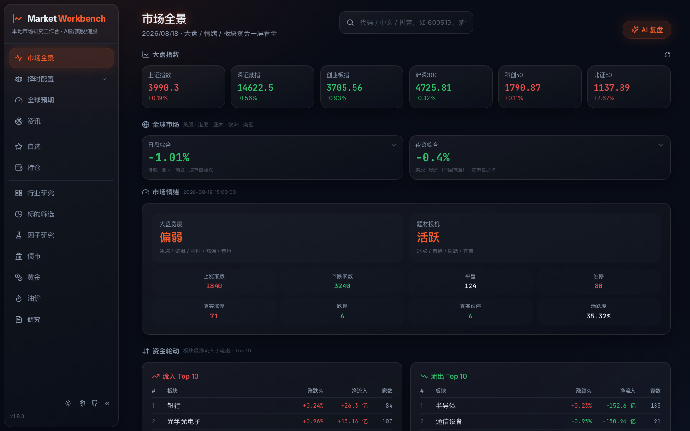

<p align="center"><a href="README.md">简体中文</a> | <b>English</b></p>

# Market Workbench

[](CHANGELOG.md)
[](https://www.python.org/)
[](https://react.dev/)
[](LICENSE)

A locally hosted research workspace for China A-shares, with Hong Kong and US market coverage. It brings together quotes, financials, filings, fund flows, macro data, sectors and public news. You supply the AI connection; the project does not issue stock recommendations or trading instructions.

> **Project lineage:** Market Workbench is a derivative work based on [simonlin1212/Vibe-Research](https://github.com/simonlin1212/Vibe-Research), retaining its public-data and pluggable-AI foundations. This version adds macro and liquidity views; gold and fund workflows; fund holdings and watchlists; industry and thematic-board research and scoring; account-scoped data sync; and visible source and freshness state.



## Contents

- [Features](#features)
- [Quick start](#quick-start)
- [Usage](#usage)
- [Configuration and data](#configuration-and-data)
- [Development](#development)
- [Documentation](#documentation)
- [Scope and disclaimer](#scope-and-disclaimer)

## Features

| Area | What it covers |
|---|---|
| Market overview | A-share indices, global markets, market breadth, turnover, sector flows and daily review |
| Macro and liquidity | Macro indicators, liquidity signals, source metadata and freshness state |
| Securities and watchlists | A-share, HK and US quotes; charts, valuation, financials, filings, reports, fund flows and grouped watchlists |
| Sectors and gold | Industry-chain research, Shenwan industry and thematic-board views, multi-factor gold indicators |
| Portfolio and funds | Equity and fund holdings, closed positions, fund search, NAV, screening and watchlists |
| News and research | Public-news aggregation, personal report archive, research notes and reflection review |
| AI and MCP | OpenAI-compatible APIs, local CLIs and MCP data tools; models and keys remain yours |


## Quick start

Requirements: Python 3.10+, Node.js 20+, and npm.

```bash
git clone https://github.com/FLIER001/Vibe-Research.git
cd Vibe-Research

# Terminal 1: backend (http://127.0.0.1:8900)
cd backend
python3 -m venv .venv
.venv/bin/pip install -r requirements.txt
.venv/bin/python -m uvicorn app:app --host 127.0.0.1 --port 8900
```

```bash
# Terminal 2: frontend (http://127.0.0.1:5899)
cd frontend
npm install
npm run dev
```

Open <http://127.0.0.1:5899>, then create a local account. Verify the backend with:

```bash
curl -fsS http://127.0.0.1:8900/api/health
```

See [docs/getting-started.md](docs/getting-started.md) for the full local setup.

## Usage

1. In Settings, choose a local CLI or enter your own OpenAI-compatible API configuration.
2. Add securities to Watchlist or record your own holdings and closed positions.
3. Review source data and freshness from market, macro, sector and security pages before asking for research.

The backend also exposes an HTTP API and an MCP Server. [backend/README.md](backend/README.md) covers the MCP installation and the main API groups.

## Configuration and data

- No environment variables are required for local development. The frontend proxies `/api` to `http://127.0.0.1:8900` by default.
- For public deployment, set `VR_ALLOW_ORIGINS` and `VR_API_KEY`; see [backend/.env.example](backend/.env.example).
- Accounts, portfolios and uploaded reports are stored on the machine that runs the backend, under `~/.vibe-research/` by default. `VR_DATA_DIR` and `VR_REPORTS_DIR` relocate portfolio and report storage.
- API keys are held in browser local storage and are sent only to the backend you run.

See [docs/configuration.md](docs/configuration.md) for variables, deployment notes and backup locations.

## Development

```bash
# Backend tests
cd backend
.venv/bin/python -m pytest tests -q

# Frontend tests and build
cd frontend
npm test
npm run build
```

`frontend/package.json` is the single source of truth for the project version. The API, MCP server and UI read from it. See [CHANGELOG.md](CHANGELOG.md) for releases.

## Documentation

- [Getting started](docs/getting-started.md): local setup, verification and common issues
- [Configuration](docs/configuration.md): environment variables, data paths and public deployment
- [Architecture](docs/architecture.md): frontend, backend, data sources and AI interfaces
- [Backend API and MCP](backend/README.md)
- [Roadmap](ROADMAP.md)

## Scope and disclaimer

Market Workbench organizes public data and information you enter yourself. It does not recommend securities, forecast prices, time trades or promise returns. Indicators, rankings and AI output are not investment advice; verify sources and make independent decisions.

## License

[MIT](LICENSE)
