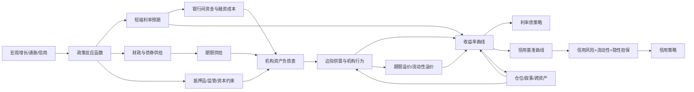

# 中国债市研究框架：从宏观、政策到资金、机构行为与风险溢价

> **版本**：v1.1（语言重写版）  
> **日期**：2026-08-13  
> **用途**：中国债券市场日常研究、利率与信用策略、资产配置、风险监控、量化辅助决策  
> **证据库**：136 项；其中境内机构研报 28 项、境外机构研究 30 项、学术论文/权威工作论文 78 项。  
> **研究原则**：正文一律“观点/思路前置，随后给出证据，再给实现方法”；不把指标罗列当成框架，不把回测相关性当因果。

---

## 0. 一页结论

### 0.1 核心观点

**债市研究的核心任务，是沿着定价链条回答五个连续问题：**

1. **宏观与通胀的边际变化，如何改变政策反应函数？**
2. **政策如何改变未来短端利率路径，以及期限溢价？**
3. **资金面、政府债供给和金融机构资产负债表，谁在决定边际定价？**
4. **当前收益率/利差中，已经计入了多少预期，剩余风险补偿是否足够？**
5. **交易表达以后，收益来自票息、骑乘、久期、利差还是杠杆；什么情形会让逻辑失效？**

因此，推荐把中国债市建模为：

> **宏观状态 → 政策反应 → 资金与融资条件 → 债券供需/机构行为 → 收益率曲线与期限溢价 → 信用/流动性溢价 → 仓位与叙事 → 策略P&L**

其中存在反馈：利率变化会影响机构负债、赎回、杠杆和风险偏好，再反过来影响利率。

这比传统的“增长 + 通胀 → 利率”框架更适合中国。华泰张继强团队对资金面和机构行为的持续研究，以及海外 preferred-habitat、intermediary balance sheet、term-premium 文献，共同指向一个结论：**边际投资者的资产负债表和债券供给本身就是核心定价变量，应进入一级研究框架**。[CN01][CN03][A37][A38][A42]

### 0.2 三条总原则

**原则一：先拆价格，再找驱动。**  
长端国债收益率至少要拆成“未来短端利率预期 + 期限溢价”；信用债还要再拆信用损失、信用风险溢价、流动性及制度/期权因素。否则同样的10bp变化，可能对应完全不同的策略含义。[A03][A04][A09][A58]

**原则二：先找边际定价者，再看总量。**  
低利率、资产荒或监管约束下，银行、保险、理财、债基、货基和券商的边际行为可能比当月宏观数据更直接。[CN03][CN24][A38][A42][A49]

**原则三：研究结论必须带“失效条件”。**  
任何“看多/看空”都必须写清：定价驱动、预期差、催化剂、时间窗口、反证指标、风险预算。没有失效条件的观点不能进入组合。

---

## 1. 定价母公式：所有研究先回到价格分解

### 1.1 观点

**预测10年国债前，应先识别收益率变化来自短端利率预期，还是来自期限溢价。**

对 n 期无违约债，可写成近似：

```text
n期收益率
= 未来n期短端无风险利率的平均预期
+ n期期限溢价
```

即：

```math
y_t^{(n)} \approx \frac{1}{n}\sum_{i=0}^{n-1} E_t(r_{t+i}) + TP_t^{(n)}
```

预期假说的大量实证失败，意味着 `TP` 具有明显时变性。[A01][A02][A03][A06]

信用债进一步拆成：

```text
信用债收益率
= 基准无风险/互换曲线
+ 预期信用损失
+ 信用风险溢价
+ 流动性溢价
+ 税收/资本占用/抵押品/期权等制度性补偿
```

因此，“信用利差收窄”只说明市场要求的综合补偿下降；信用风险、流动性和风险偏好需分别验证。[A56][A58][A59][A60]

### 1.2 实现

对组合收益做统一归因：

```math
TR \approx Carry + Roll - D_{mod}\Delta y
+ \frac{1}{2}Convexity(\Delta y)^2
- SD\cdot\Delta s
- CreditLoss - FundingCost - TradingCost
```

其中：

- `Carry`：票息/静态持有收益；
- `Roll`：曲线不变时随剩余期限缩短获得的骑乘收益；
- `D_mod`：修正久期；
- `SD`：spread duration；
- `Δs`：信用/品种利差变化；
- `FundingCost`：回购/资金成本；
- `TradingCost`：买卖价差、冲击成本、换仓成本。

**研究输出必须明确，预期收益主要来自哪一项。**

---

## 2. 总体架构：三种速度、八个状态变量

### 2.1 观点

债市变量需要按信息更新速度和影响期限分层。建议划分为三种“时钟”：

| 时钟 | 典型期限 | 核心变量 | 作用 |
|---|---:|---|---|
| 慢变量 | 1–5年 | 潜在增长、人口、债务、银行/保险负债结构、监管制度 | 决定利率中枢与市场结构 |
| 中速变量 | 1–12月 | 增长、通胀、信用周期、财政、货币政策 | 决定趋势和主要拐点 |
| 快变量 | 日–数周 | 资金面、供给节奏、机构流、期货仓位、赎回、叙事 | 决定入场点、波动和超调 |

**同一变量的权重随预测期限变化。**  
1–10个交易日重点观察资金、供需和仓位；3–12个月则提高宏观、政策和期限溢价变量权重。

### 2.2 八个统一状态

建议每日维护八个状态分数，均标准化为 `[-2, +2]`：

1. `Macro`：增长/通胀/信用状态；
2. `Policy`：货币、财政、监管的方向与力度；
3. `Funding`：资金数量、价格、结构、稳定性；
4. `SupplyDemand`：政府债供给与机构承接；
5. `CurveTP`：曲线、远期利率、期限溢价、carry/roll；
6. `Credit`：信用基本面、隐性担保、流动性和信用估值；
7. `Positioning`：仓位、杠杆、拥挤、赎回、期货/现券结构；
8. `Global`：海外利率、美元、商品、全球风险偏好。

**正分统一定义为“对债券价格有利/对收益率下行有利”**，防止跨模块符号混乱。

### 2.3 架构图



---

## 3. 宏观层：边际变化与预期差决定交易含义

### 3.1 观点

**宏观数据对债券价格的影响，取决于实际结果相对预期的偏离，以及该偏离是否足以改变政策路径。**

宏观层只回答三件事：

- 名义增长是在改善还是恶化？
- 通胀/通缩压力是否足以改变央行约束？
- 信用和房地产是否改变未来现金流与融资需求？

海外宏观金融模型表明，宏观变量能解释收益率曲线的重要部分，但长端仍有大量变化来自潜在因子与风险溢价，因此，长债研究需要同时纳入潜在因子和时变风险溢价。[A08][A10][A16][A27]

### 3.2 中国重点变量

**增长：**

- PMI及分项、工业增加值、服务业生产；
- 发电/货运/高频开工率；
- 房地产销售、土地、开工、库存；
- 出口、订单、全球制造业周期；
- 企业盈利、价格-利润传导。

**通胀：**

- CPI/PPI及核心分项；
- 大宗商品、猪价、能源、服务价格；
- GDP平减指数/名义增长；
- 工业品价格扩散指数。

**信用：**

- 社融存量/新增、信贷结构；
- 政府融资、企业中长贷、居民中长贷；
- M1/M2、存款结构；
- 信用脉冲，并结合单月同比作辅助验证。

### 3.3 实现

不建议建立一个“宏观总分”就结束。至少做四层：

1. **趋势**：3M/6M变化率、扩散指数；
2. **预期差**：实际值 - 市场一致预期；
3. **政策敏感度**：该指标历史上对政策利率/资金面是否有解释力；
4. **价格确认**：数据发布后短端、长端、商品、权益是否同向确认。

推荐字段：

```text
indicator
release_time
as_of_time
actual
consensus
previous_vintage
surprise_z
trend_z
policy_beta
market_reaction_30m
market_reaction_1d
```

**必须保存 point-in-time vintage，禁止用后来修订值做回测。**

---

## 4. 政策层：把“宽松/收紧”拆成短端路径与期限溢价渠道

### 4.1 观点

**货币政策影响债市至少有两条渠道：**

- **预期渠道**：改变未来短端政策利率/资金利率路径；
- **期限溢价/资产负债表渠道**：通过央行资产负债表、抵押品、债券供需和风险承载能力影响长端。

因此，降息对长债的影响取决于短端预期与期限溢价的合成结果。若财政供给、通胀不确定性或期限溢价同步上升，曲线可能变陡。[A31][A33][A34][A35][GI20]

中国还需要加入第三条：

- **制度/抵押品渠道**：哪些债券可用于央行融资、资本计量、流动性监管或质押，会直接影响相对估值。[A67]

### 4.2 实现

建立 `Policy Reaction Function`，政策文本关键词仅作为辅助特征。

每次政策事件记录：

```text
政策目标：增长 / 通胀 / 汇率 / 金融稳定 / 银行息差 / 防空转 / 财政协同
工具类型：价格型 / 数量型 / 结构型 / 抵押品 / 监管型
作用期限：隔夜-1M / 3M-1Y / 2Y以上
主要渠道：短端预期 / 流动性 / 供给 / 风险偏好 / 机构资本
预期内程度：完全预期 / 部分预期 / 意外
后续验证指标：资金利率 / 信贷 / 汇率 / 政府债发行 / 银行行为
```

财政政策单独维护：

- 国债、地方债、政策性金融债净融资；
- 按期限换算的 `DV01 supply`，而不只看名义发行额；
- 发行节奏与缴款日期；
- 财政存款变化、税期；
- 置换债/特殊再融资对信用和利率供给的再分配。

---

## 5. 资金面：以“数量—价格—结构—稳定性”统一观察

### 5.1 观点

张继强团队资金框架的核心贡献在于以下判断：

> **资金面的核心是银行体系可用流动性；研究应同时覆盖流动性缺口、央行可容忍的资金价格、非银融资结构和资金稳定性。** [CN01][CN02]

对交易而言，**资金面直接体现利率市场的融资约束，并通过杠杆和交易链条影响现券价格**。当杠杆和拥挤较高时，资金冲击会非线性放大为现券抛压，这与 funding liquidity—market liquidity spiral 的理论一致。[A45]

### 5.2 四维框架

| 维度 | 先回答的问题 | 核心指标 |
|---|---|---|
| 数量 | 银行体系可用流动性够不够？ | 央行操作、政府存款、现金、法准、超储代理 |
| 价格 | 资金实际贵不贵？市场预期多紧？ | DR001/DR007、R001/R007、存单、IRS |
| 结构 | 谁在融出，谁在加杠杆？ | R-DR利差、银行/非银回购、机构净融入 |
| 稳定性 | 宽松是否能持续？ | 税期、跨季、节假日、缴款、考核、逆回购到期 |

### 5.3 实现

**超储率适合用于状态识别，不宜追求伪精确预测。**  
更可操作的是做“资金状态判别”：

```text
FundingScore =
0.30 * PriceScore
+ 0.25 * StructureScore
+ 0.25 * StabilityScore
+ 0.20 * QuantityScore
```

上式只是初始先验，权重需用样本外表现校准。

推荐监控：

- DR001、DR007与政策操作利率偏离；
- R001-DR001、R007-DR007；
- 1Y同业存单与短端国债/政策债利差；
- FR007/Repo IRS曲线；
- 隔夜成交占比、质押式回购余额；
- 非银净融入与杠杆；
- 跨月/跨季远期资金价格；
- 未来10个交易日央行工具到期、政府债缴款、税期、节假日。

输出不写“资金松/紧”四个字就结束，而写：

```text
当前状态：宽松但脆弱 / 中性稳定 / 收敛且结构性紧张
驱动：央行净投放 + 银行融出 / 非银加杠杆 / 税期
持续性：高 / 中 / 低
对曲线影响：短端、长端、信用杠杆分别如何
反证：哪一个价差/成交结构变化会推翻判断
```

---

## 6. 供需与机构行为：先找“谁有钱、谁缺券、谁被迫卖”

### 6.1 观点

**中国债市在低利率、强监管、资产荒或赎回冲击阶段，机构行为会直接进入价格形成过程。**

preferred-habitat 理论强调，不同期限债券存在市场分割与不完全替代性；当偏好某一久期的投资者需求变化，而套利资本有限时，局部供给会改变收益率和期限溢价。[A37][A38][A39]

中介资产负债表文献进一步说明，做市商、银行等的资本与融资能力会影响它们吸收供给的能力。[A42][A46][A47]

### 6.2 中国机构地图

| 机构 | 主要负债/约束 | 通常偏好 | 最应跟踪 |
|---|---|---|---|
| 大行/股份行 | 存款、信贷、资本、流动性指标、息差 | 利率债、地方债、存单 | 存款迁移、贷款机会成本、净息差、债券投资增量 |
| 城农商行 | 地域负债、资本、流动性 | 利率债、信用、存单 | 同业负债、配置强度、监管指标 |
| 保险 | 长久期负债、偿付能力、会计 | 超长国债/地方债、高等级信用 | 保费现金流、负债久期、超长供给 |
| 理财 | 净值波动、赎回、客户风险偏好 | 短久期信用、存单 | 规模、破净、赎回、现金仓 |
| 债券基金 | 相对排名、赎回、杠杆 | 利率/信用、多期限 | 份额、久期、杠杆、回撤 |
| 货币基金 | 高流动性 | 存单、短债 | 规模、存单配置、资金价格 |
| 券商自营 | 风险预算、VaR、融资 | 波段、曲线、期货现券 | 基差、套保、杠杆、止损 |
| 外资 | 汇率、对冲成本、指数权重 | 国债/政金债 | 对冲后利差、汇率、托管量 |

华泰对2025年末的复盘直接体现了这种差异：银行、债基、保险、理财在同一利率环境下具有完全不同的边际行为。[CN03]

### 6.3 实现：机构需求矩阵

对每类机构构造：

```text
DemandCapacity
= LiabilityInflow
+ ReinvestmentCash
- RedemptionOutflow
- CapitalConstraint
- AlternativeAssetOpportunityCost
```

再按期限分桶：

```text
0-1Y / 1-3Y / 3-5Y / 5-10Y / 10-20Y / 20Y+
```

供给侧不用“发行额”而用：

```text
DurationSupply(bucket)
= NetIssuance * ModifiedDuration
```

最终关注：

```text
AbsorptionGap(bucket)
= DurationSupply(bucket) - EstimatedMarginalDemand(bucket)
```

这比简单的“本周发行1万亿”更接近价格冲击。

---

## 7. 收益率曲线与期限溢价：曲线承担状态识别与信息压缩功能

### 7.1 观点

**曲线本身包含对政策路径、风险溢价、供需和对冲需求的压缩信息。**

传统 level/slope/curvature 因子能解释大部分曲线变化；风险溢价仍需单独识别。Cochrane–Piazzesi、Duffee、ACM 等文献说明，预测债券超额收益需要额外识别时变风险补偿。[A03][A04][A05][A09]

### 7.2 实现一：曲线因子

同时保留两套表达：

**经济直觉表达**

- Level：5–10Y或全曲线水平；
- Slope：10Y-1Y、10Y-2Y；
- Curvature：2×5Y - 2Y - 10Y 等；
- Long-end slope：30Y-10Y。

**统计表达**

- PCA前3–5个因子；
- Dynamic Nelson-Siegel（DNS）。[A11][A12]

两套同时存在：前者用于解释，后者用于降维/预测。

### 7.3 实现二：期限溢价

期限溢价估计应采用多模型交叉验证，至少包括以下三类方法：

1. `ACM-style`：收益率PCA + excess return回归；[A09]
2. `Survey-anchored`：用调查/政策路径预期锚定未来短端，再残差化；
3. `Simple residual`：长端收益率 - 加权短端预期代理，用于高频监控。

只有三者方向一致，才给高置信度结论。

### 7.4 实现三：carry / roll / forward

每日期限节点计算：

```text
Yield
ForwardRate
1M/3M Carry
1M/3M RollDown
Duration
Convexity
BreakevenYieldRise
```

`BreakevenYieldRise` 的含义：

> 在持有期内，收益率最多上行多少，票息+骑乘仍能抵消资本损失。

震荡市中，这往往比“预测终点收益率”更有决策价值。

---

## 8. 信用债：五维框架要与利率框架共用同一底座

### 8.1 观点

华泰2026信用策略把信用研究归纳为五维：**基本面和利率趋势、信用债供需与机构行为、信用风险、收益率与利差、资金面**。[CN05]

这与学术文献高度一致：信用利差既包含预期损失，也包含系统性信用风险、流动性、税制/制度、资金和中介约束。[A56][A58][A59][A60][A65]

因此，信用研究应复用利率、资金和机构行为底座，再增加主体信用与流动性模块。

### 8.2 信用五维统一表

| 维度 | 核心判断 | 实现 |
|---|---|---|
| 利率/宏观 | 基准曲线方向与波动 | 复用 Macro/Policy/CurveTP |
| 供需/机构 | 谁在增配/赎回，什么期限缺资产 | 托管、基金份额、发行净融资、机构成交 |
| 信用风险 | 违约概率、回收率、尾部事件 | issuer/sector/region评分与预警 |
| 估值 | 利差补偿是否足够 | OAS/曲线利差/历史分位/同业比较 |
| 资金 | 杠杆是否可持续 | repo cost、haircut、融资稳定性 |

### 8.3 中国信用必须单列“隐性担保”

中国企业债/城投/地方相关资产存在明显的制度与隐性支持定价；学术研究发现所有制、中央/地方背景以及政策变化会影响融资成本和利差。[A71][A72][A73][A75]

因此，主体财务指标用于刻画独立偿债能力，市场违约概率还需纳入外部支持、融资条件和流动性。

建议分解：

```text
CreditScore
= StandaloneCredit
+ ExternalSupport
+ Liquidity
+ TechnicalDemand
+ Valuation
```

但在风险管理上使用：

```text
RiskGate = min(StandaloneCredit, LiquidityStress, EventRisk)
```

即：**策略评分可以加总；信用风险闸门采用最弱环节约束。**

### 8.4 信用风险闸门

若满足任一条件，高票息或高利差不得单独构成加仓依据：

- 现金/短债显著恶化且再融资依赖上升；
- 关键融资渠道收缩；
- 担保/交叉违约/诉讼链条恶化；
- 地方或集团支持能力下降；
- 二级成交断层、估值滞后；
- 信用利差扩大与权益/商品/银行授信同时验证；
- 事件窗口内存在重大不确定性。

---

## 9. 仓位、流动性与“叙事”：只做放大器，不做基本面替代品

### 9.1 观点

**叙事主要解释短期价格变化的速度和幅度；长期定价仍需由现金流、政策、供需和风险溢价验证。**

低波动持续越久，久期、杠杆、信用下沉往往越拥挤；一旦资金或赎回反转，流动性冲击会把基本面小变化放大成大价格变化。[CN06][CN12][A45][A50][A51]

### 9.2 实现：Crowding Score

监控：

- 国债期货持仓、成交、主力/次主力价差；
- CTD基差、IRR、期现联动；
- 现券成交活跃度、换手；
- 回购余额与隔夜占比；
- 基金份额/净申赎；
- 保险/理财/基金净买入代理；
- 关键券估值偏离、repo specialness；
- 隐含/实现波动率；
- 股债相关性；
- 媒体/研报观点集中度。

建议：

```text
Crowding =
PositionZ
+ LeverageZ
+ FlowConcentrationZ
+ ValuationStretchZ
+ LowVolComplacencyZ
```

拥挤度不直接触发反向交易，建议作为预期收益的风险折扣项：

```text
ExpectedReturnAdjusted = BaseExpectedReturn - lambda * CrowdingRisk
```

### 9.3 叙事验证表

每个主流叙事都必须填写：

1. 叙事是什么？
2. 哪个数据最能证伪？
3. 价格已经计入多少？
4. 哪类机构最相信并已持仓？
5. 下一个催化剂是什么？
6. 若催化剂未兑现，仓位会不会反向挤兑？

---

## 10. 海外变量：按传导渠道评估对中国债市的影响

### 10.1 观点

中国利率对海外利率的敏感度是**状态依赖**的。主要通过：

- 汇率与货币政策空间；
- 跨境资金和对冲后相对收益；
- 全球风险偏好；
- 大宗商品与输入性通胀；
- 全球期限溢价/安全资产需求。

海外机构近年的共同结论之一，是长端收益率对财政供给和期限溢价的敏感度上升；主动管理需要同时管理久期、曲线、信用和地区分散。[GI02][GI18][GI20][GI25]

### 10.2 实现

全球模块至少包含：

```text
UST 2Y / 5Y / 10Y / 30Y
US term premium proxies
UST curve slopes
Fed OIS path
US Treasury net duration supply
DXY / CNH
China-US hedged yield differential
Brent / copper / gold
VIX / MOVE
EM local bond index
```

对中国的影响以 rolling beta + regime interaction 估计：

```math
\Delta y_{CNY} =
\alpha +
\beta_1 \Delta y_{UST}
+ \beta_2 \Delta FX
+ \beta_3 RiskOff
+ \beta_4(\Delta y_{UST}\times FXRegime)
+ \epsilon
```

重点在于识别 beta 的状态依赖性及其跃迁条件。

---

## 11. 统一信号引擎：框架负责解释，模型负责纪律

### 11.1 观点

**不建议训练一个黑箱模型直接预测10Y收益率。**  
更稳健的是先由框架生成可解释状态，再让模型校准权重。

### 11.2 多期限权重先验

| 模块 | 1–10交易日 | 1–3个月 | 3–12个月 |
|---|---:|---:|---:|
| Macro | 低 | 中 | 高 |
| Policy | 中 | 高 | 高 |
| Funding | 高 | 高 | 中 |
| SupplyDemand | 高 | 高 | 中高 |
| CurveTP/Valuation | 中高 | 高 | 高 |
| Credit | 低/品种相关 | 中 | 中高 |
| Positioning | 高 | 中高 | 低中 |
| Global | 中 | 中 | 中 |

用样本外结果校准，不在全样本内把权重拟合到极致。

### 11.3 组合分数

```math
B_{h,t} =
\sum_k w_{k,h} z_{k,t}
+ \sum_{i<j} \gamma_{ij,h} z_{i,t}z_{j,t}
- \lambda_h Crowding_t
```

其中 `B > 0` 表示对债券价格友好。

最重要的交互项：

- `Macro × Policy`：弱增长是否真的触发政策；
- `Funding × Positioning`：资金收紧遇到高杠杆；
- `Supply × DemandCapacity`：供给冲击是否有承接；
- `Valuation × Crowding`：便宜/贵是否伴随拥挤；
- `Credit × Liquidity`：信用恶化是否同时成交失灵。

### 11.4 概率化输出

输出采用概率与区间表达：

```text
DurationView: Bullish / Neutral / Bearish
Probability: 0-100%
ExpectedMove: bp区间
Horizon: 5D / 20D / 60D
Confidence: Low / Medium / High
DominantDrivers: top 3
ContraryEvidence: top 2
Invalidation: 明确数值/事件
```

---

## 12. 策略层：先定义收益来源，再决定用什么工具表达

### 12.1 久期

**适合：** 宏观/政策/期限溢价方向一致。  
**不适合：** 方向分歧大但carry好。

执行：

```text
目标DV01
= 组合NAV × 风险预算 / 允许的bp冲击
```

同时跟踪：

- DV01；
- convexity；
- 关键期限风险；
- 期货/现券basis；
- 融资成本。

### 12.2 曲线

曲线策略优先于“猜单点收益率”，尤其当：

- 短端由政策锚定；
- 长端由供给/期限溢价主导；
- 某期限存在偏好栖息需求。

常用：

- 1s10s / 2s10s steepener/flattener；
- 5s10s；
- 10s30s；
- butterfly；
- 国债—政金债；
- 现券—IRS；
- 期货跨品种/跨期。

所有曲线策略用 **DV01-neutral** 或明确暴露，禁止只按名义本金配比。

### 12.3 Carry + Roll

当方向信号不强，优先找：

```text
ExpectedHoldingReturn
= Carry + Roll - ExpectedMarkToMarketLoss - Funding
```

并计算 breakeven。

### 12.4 信用

信用策略拆成：

- 票息；
- 久期；
- 骑乘；
- 杠杆；
- 品种；
- 下沉；
- 波段。

这与华泰信用策略七类基础策略相对应。[CN05]

### 12.5 风险预算

至少四个预算：

1. `Rate DV01`;
2. `Spread DV01`;
3. `Funding / leverage`;
4. `Liquidity-at-Risk`.

极端场景不只冲击收益率，还要同时冲击：

```text
资金 +50bp
利率 +20/+40/+80bp
信用利差 +30/+80/+200bp
成交成本 ×2/×4
赎回导致被动减仓
股债相关性由负转正
```

---

## 13. 日/周/月研究工作流

### 13.1 日频：回答“今天谁在定价”

**开盘前**

- 央行操作与到期；
- 政府债发行/缴款；
- DR/R/存单/IRS；
- 隔夜海外利率、商品、汇率；
- 今日政策/数据事件。

**盘中**

- 期货价量与基差；
- 活跃券与曲线；
- 资金成交；
- 机构成交代理；
- 股债相关性。

**收盘后**

只写六行：

```text
1. 今日主导因子：
2. 与昨日相比的状态变化：
3. 价格是否超调：
4. 谁在买/谁在卖：
5. 明日催化剂：
6. 失效条件：
```

### 13.2 周频：回答“趋势是否在积累”

更新：

- 宏观高频扩散；
- 政府债净供给/DV01供给；
- 托管/基金/理财/保险行为；
- 曲线carry/roll；
- 期限溢价；
- 信用利差矩阵；
- 拥挤度；
- 组合风险。

### 13.3 月频：回答“中期框架是否切换”

做：

- 宏观 regime；
- 政策反应函数重估；
- 机构资产负债表；
- 信用迁徙；
- 模型权重稳定性；
- 回测 walk-forward 更新；
- 主叙事证伪/延续。

---

## 14. 数据层：先解决时间戳和可复现，再谈模型

### 14.1 推荐数据源

**官方/准官方优先：**

- 中国人民银行；
- 国家统计局；
- 财政部；
- 中国债券信息网/中债登；
- 上海清算所；
- 中国外汇交易中心/银行间市场相关公开数据；
- 中国银行间市场交易商协会；
- 证监会、交易所；
- 中国证券投资基金业协会；
- 中金所；
- 发行人公告与审计报告。

**商业数据库用于补充与交叉核验：**

- Wind / Choice / iFinD 等；
- 机构研究数据库；
- 基金持仓和估值数据库。

### 14.2 数据仓库最小字段

```text
series_id
value
observation_date
release_datetime
available_datetime
revision_id
source
frequency
unit
transform
quality_flag
```

**`available_datetime` 是回测的关键。**

### 14.3 事件库

建立可查询的 event table：

```text
event_id
event_type
announce_time
effective_time
expected
actual
surprise
policy_channel
curve_reaction_5m
curve_reaction_30m
curve_reaction_1d
flow_reaction
notes
```

长期积累后，事件库比“凭记忆复盘”更有价值。

---

## 15. 模型验证：防止债市研究最常见的四类伪信号

### 15.1 观点

债市变量高自相关、制度切换频繁、样本少，最容易得到“全样本很好、实盘失效”的模型。

### 15.2 四类错误

1. **Look-ahead**：使用修订数据、完整基金持仓、未来可得估值；
2. **重叠收益**：20日收益逐日滚动导致t值虚高；
3. **制度漂移**：政策工具/投资者结构变化后参数失效；
4. **成本忽略**：信用与曲线策略纸面alpha被交易成本吃掉。

### 15.3 验证框架

预测目标建议分开：

```text
5D / 20D / 60D：
- Δ10Y国债收益率
- 5-10Y利率债超额收益
- 2s10s / 10s30s变化
- 高等级信用超额收益
- 信用利差变化
```

指标：

- MAE/RMSE；
- direction accuracy；
- rank IC；
- probability Brier score；
- 策略Sharpe；
- 最大回撤；
- turnover；
- cost-adjusted return；
- hit-rate conditional on high confidence。

采用：

- rolling / expanding walk-forward；
- Newey-West或非重叠窗口；
- regime split；
- 特征ablation；
- 权重稳定性；
- 同时检验经济意义和统计显著性。

---

## 16. 最小可用系统（MVP）

### 阶段一：先把研究变成“可复现状态表”

**目标：** 不预测，只把八个状态变量做对。

输出：

```text
Macro        +0.5
Policy       +1.0
Funding      +1.4
SupplyDemand +0.7
CurveTP      -0.8
Credit       +0.2
Positioning  -1.3
Global       -0.4
```

并强制显示过去1D/5D/20D变化。

### 阶段二：建立期限与品种映射

给每个状态估计：

```text
beta_to_1Y
beta_to_5Y
beta_to_10Y
beta_to_30Y
beta_to_credit_1-3Y
beta_to_credit_3-5Y
```

### 阶段三：只在高置信度状态做策略映射

例如：

```text
Funding + SupplyDemand 很强
但 CurveTP昂贵 + Positioning拥挤
=> 不做满久期；优先中短端carry/roll或曲线相对价值
```

这比一个“综合分=0.8，所以买10年国债”更符合真实投资流程。

---

## 17. 建议的最终研究报告模板

```markdown
# 债市观点 YYYY-MM-DD

## 结论（先说）
- 方向：
- 期限：
- 最优表达：
- 置信度：

## 三个最重要的驱动
1.
2.
3.

## 两个反向证据
1.
2.

## 定价分解
- 短端路径：
- 期限溢价：
- 供需：
- 信用/流动性：

## 机构行为
- 银行：
- 保险：
- 理财：
- 基金：
- 券商/外资：

## 估值与策略
- carry/roll：
- 曲线：
- 信用：
- DV01/Spread DV01：

## 催化剂与失效条件
- 催化剂：
- 失效条件：
- 风险预算：
```

---

## 18. 框架的五个“禁止项”

1. **禁止** 用单个宏观指标直接推出长债方向；
2. **禁止** 用“资金净投放”替代资金价格与结构；
3. **禁止** 只看发行额，不看期限供给与边际承接；
4. **禁止** 用历史分位数单独定义“贵/便宜”；
5. **禁止** 给方向结论而没有催化剂、时间窗口和失效条件。

---

# 附录A：证据与框架的对应关系

| 模块 | 核心机构证据 | 核心学术证据 |
|---|---|---|
| 资金面 | CN01, CN02, CN07, CN10 | A45 |
| 机构行为/供需 | CN03, CN22, CN24, CN25, CN28 | A37-A42, A46-A50 |
| 曲线/期限溢价 | GI02, GI18-GI20 | A01-A24 |
| 货币政策 | CN21, GI19-GI20 | A24, A29-A36, A67-A69 |
| 信用 | CN05 | A55-A78 |
| 流动性/赎回 | CN03, CN25 | A45, A50-A54, A60-A64 |
| 叙事/拥挤 | CN06, CN12, CN18 | A03, A21, A45 |
| 全球配置 | GI01-GI30 | A13, A31-A44 |

---

# 附录B：本次研究证据库（136项）

## B1. 境内金融机构研报（28项）

- **[CN01]** 2025-03-06｜华泰证券·张继强/吴宇航/仇文竹/欧阳琳｜《资金面分析框架与跟踪体系》｜资金面/超储/机构
- **[CN02]** 2025-05-21｜华泰证券·张继强/吴宇航/仇文竹｜《资金面是否还有宽松空间？》｜资金面/央行态度
- **[CN03]** 2025-12-21｜华泰证券·张继强/仇文竹/吴宇航/欧阳琳｜《机构行为仍是关键》｜机构行为/低利率
- **[CN04]** 2025-12-26｜华泰证券·张继强/吴宇航/仇文竹/欧阳琳｜《透支与低利率的代价——2025年债市复盘与思考》｜年度复盘/市场生态
- **[CN05]** 2026-02-27｜华泰证券·张继强/文晨昕/向怡乔｜《信用策略复盘与框架重构》｜信用/五维框架
- **[CN06]** 2026-03-02｜华泰证券·张继强团队｜《为什么“叙事经济学”大行其道？》｜叙事/拥挤/跨资产
- **[CN07]** 2026-04-19｜华泰证券·张继强团队｜《资金面成为关键变量》｜资金面/杠杆/供给
- **[CN08]** 2026-04-22｜华泰证券·张继强团队｜《债市突破关键点位进入新阶段》｜利率/曲线/非银需求
- **[CN09]** 2026-05-25｜华泰证券·张继强团队｜《2026年中期债市展望：双重K型分化下的债市》｜中期展望/结构分化
- **[CN10]** 2026-06-11｜华泰证券·张继强团队｜《资金面收敛的逻辑与展望》｜资金面/央行操作
- **[CN11]** 2026-07-12｜华泰证券·张继强团队｜《当债市僵局遇到易变盘季》｜季节性/事件/机构
- **[CN12]** 2025-07-01｜华泰证券·张继强团队｜《趋势力量尚存，但拥挤度偏高》｜拥挤度/趋势
- **[CN13]** 2025-03-24｜华泰证券·张继强团队｜《夹缝中交易的债市》｜震荡/交易
- **[CN14]** 2025-05-19｜华泰证券·张继强团队｜《窄幅震荡成为一致预期》｜一致预期/波动
- **[CN15]** 2025-11-19｜华泰证券·张继强团队｜《好风凭借力——2026年固收+产品展望》｜固收+/资产配置
- **[CN16]** 2021-02-28｜华泰证券·张继强/王菀婷｜《短暂的平衡会如何打破？》｜利率/资金/曲线
- **[CN17]** 2019｜华泰证券·张继强团队｜《债市历史上的四轮流动性冲击与启示》｜流动性冲击/复盘
- **[CN18]** 2020-11-29｜华泰证券·张继强团队｜《债市一致预期的形成与应对》｜一致预期/交易
- **[CN19]** 2019-11-18｜华泰证券·张继强团队｜《滞胀表象，枕戈待旦》｜年度策略/信用/久期
- **[CN20]** 2020-06-01｜华泰证券·张继强团队｜《关注资产配置的三条新主线》｜政策/资产配置
- **[CN21]** 2024-09｜中金公司固定收益团队｜《畅通传导、维持陡峭——公开市场重启买卖国债点评》｜央行国债交易/曲线
- **[CN22]** 2024｜中金公司固定收益团队｜《中国利率策略周报：从金融机构半年报看三四季度债券配置》｜机构配置/利率
- **[CN23]** 2026-04-01｜中金公司固定收益团队｜《固收+年报隐含的信息》｜基金/机构行为
- **[CN24]** 2026-04-18｜中金公司固定收益团队｜《资金宽松及非银需求上升才是超长债的主要逻辑》｜超长债/非银/资金
- **[CN25]** 2026-06-13｜中金公司固定收益团队｜《阶段性的基金赎回无碍债牛趋势，配置盘才是市场“定海神针”》｜基金赎回/配置盘
- **[CN26]** 2026-02-06｜中金公司固定收益团队｜《固收+基金如何应对大资管分工趋势？》｜资管/机构分工
- **[CN27]** 2025-08-04｜中信证券·明明团队｜《反内卷、通胀和利率间的长期逻辑》｜通胀/政策/利率
- **[CN28]** 2026-07-12｜中信证券·明明团队｜《6月：跨季约束下的机构行为再平衡》｜跨季/机构行为

## B2. 境外金融机构研究（30项）

- **[GI01]** 2026 Q3｜BlackRock｜*Fixed Income Outlook Q3 2026*｜利率/信用/主动管理
- **[GI02]** 2025｜BlackRock Systematic Fixed Income｜*2025 Systematic Fixed Income Outlook*｜期限溢价/曲线
- **[GI03]** 2026｜BlackRock｜*Singapore Fixed Income Outlook 2026*｜供给冲击/相关性
- **[GI04]** 2025-2026｜BlackRock｜*US Treasuries, a Risky Safe Asset*｜美债/期限溢价/安全资产
- **[GI05]** 2025 Fall｜BlackRock｜*Fall 2025 Fixed Income Outlook*｜曲线/中段/财政
- **[GI06]** 2026｜BlackRock Investment Institute｜*2026 Investment Outlook（Fixed Income sections）*｜宏观/跨资产
- **[GI07]** 2026｜Amundi｜*2026 Investment Outlook*｜全球资产/债券
- **[GI08]** 2026｜Amundi｜*Fixed Income Outlook 2026*｜货币政策/财政/信用
- **[GI09]** 2026 Mid-Year｜Amundi｜*2026 Mid-Year Outlook*｜利率/信用/新兴市场
- **[GI10]** 2026 Mid-Year｜Amundi Fixed Income｜*Fixed Income Mid-Year Outlook 2026*｜收益率/久期
- **[GI11]** 2026-05｜Amundi｜*Global Investment Views – May 2026*｜全球利率/风险
- **[GI12]** 2026-06｜Amundi｜*Global Investment Views – June 2026*｜全球利率/风险
- **[GI13]** 2026-07｜Amundi｜*Global Investment Views – July 2026*｜全球利率/风险
- **[GI14]** 2026-08｜Amundi｜*Global Investment Views – August 2026*｜机构流/全球利率
- **[GI15]** 2026-07｜Amundi｜*Euro Credit Market Views – July 2026*｜信用/利差
- **[GI16]** 2026 Q1｜J.P. Morgan Asset Management｜*Global Bond Monitor Q1 2026*｜全球债券/久期
- **[GI17]** 2026 Q2｜J.P. Morgan Asset Management｜*Global Bond Monitor Q2 2026*｜全球债券/久期
- **[GI18]** 2026｜J.P. Morgan Asset Management｜*2026 Year-Ahead Investment Outlook*｜政策/利率/配置
- **[GI19]** 2026｜J.P. Morgan Asset Management｜*Fixed income: Difficult decisions facing a divided Fed*｜央行分歧/久期
- **[GI20]** 2026｜J.P. Morgan Asset Management｜*How Will Fiscal and Monetary Policies Reshape Fixed Income in 2026?*｜财政/货币/期限溢价
- **[GI21]** 2026 Q2｜J.P. Morgan Asset Management｜*Global Fixed Income Views 2Q 2026*｜利率/信用
- **[GI22]** 2026 Q3｜J.P. Morgan Asset Management｜*Global Fixed Income Views 3Q 2026*｜利率/信用
- **[GI23]** 2026 Mid-Year｜J.P. Morgan Asset Management｜*2026 Mid-Year Investment Outlook（Fixed Income sections）*｜跨资产/债券
- **[GI24]** 2026 Q1｜J.P. Morgan Asset Management｜*Aggregate Fixed Income Q1 2026 Outlook*｜全球配置/债券
- **[GI25]** 2026-03｜UBS Asset Management｜*Let Your Bonds Work Smarter*｜久期/曲线/行业/汇率
- **[GI26]** 2026-01｜UBS Asset Management｜*Macro Monthly – January 2026*｜宏观/久期
- **[GI27]** 2026｜UBS｜*Asian Credit Outlook 2026*｜亚洲信用/中国债
- **[GI28]** 2026 Q3｜UBS Asset Management｜*Macro Quarterly Q3 2026*｜全球宏观/固定收益
- **[GI29]** 2026-07｜UBS｜*Lock in Yields*｜收益率/信用/新兴市场
- **[GI30]** 2026-01｜PIMCO｜*Compounding Opportunity in Bonds*｜票息/全球债券/分散

## B3. 学术论文与权威工作论文（78项）

- **[A01]** Fama & Bliss (1987), *The Information in Long-Maturity Forward Rates*, American Economic Review.｜期限结构/远期利率
- **[A02]** Campbell & Shiller (1991), *Yield Spreads and Interest Rate Movements: A Bird's Eye View*, Review of Economic Studies.｜预期假说/曲线
- **[A03]** Cochrane & Piazzesi (2005), *Bond Risk Premia*, American Economic Review.｜债券风险溢价/预测
- **[A04]** Duffee (2002), *Term Premia and Interest Rate Forecasts in Affine Models*, Journal of Finance.｜期限溢价/ATSM
- **[A05]** Duffee (2011), *Information in (and Not in) the Term Structure*, Review of Financial Studies.｜非张成因子/风险溢价
- **[A06]** Dai & Singleton (2002), *Expectation Puzzles, Time-Varying Risk Premia, and Affine Models of the Term Structure*, Journal of Financial Economics.｜预期谜题/ATSM
- **[A07]** Dai & Singleton (2000), *Specification Analysis of Affine Term Structure Models*, Journal of Finance.｜ATSM/模型检验
- **[A08]** Ang & Piazzesi (2003), *A No-Arbitrage Vector Autoregression of Term Structure Dynamics with Macroeconomic and Latent Variables*, Journal of Monetary Economics.｜宏观金融/无套利
- **[A09]** Adrian, Crump & Moench (2013), *Pricing the Term Structure with Linear Regressions*, Journal of Financial Economics.｜ACM/期限溢价
- **[A10]** Joslin, Priebsch & Singleton (2014), *Risk Premiums in Dynamic Term Structure Models with Unspanned Macro Risks*, Journal of Finance.｜非张成宏观风险
- **[A11]** Diebold & Li (2006), *Forecasting the Term Structure of Government Bond Yields*, Journal of Econometrics.｜Nelson-Siegel/预测
- **[A12]** Nelson & Siegel (1987), *Parsimonious Modeling of Yield Curves*, Journal of Business.｜收益率曲线
- **[A13]** Gürkaynak, Sack & Wright (2007), *The U.S. Treasury Yield Curve: 1961 to the Present*, Journal of Monetary Economics.｜零息曲线/数据
- **[A14]** Rebonato (2015), *Return-Predicting Factors for US Treasuries: On the Similarity of 'Tents' and 'Bats'*, International Journal of Theoretical and Applied Finance.｜风险溢价/曲线
- **[A15]** Cieslak & Povala (2015), *Expected Returns in Treasury Bonds*, Review of Financial Studies.｜通胀/利率周期/回报
- **[A16]** Ludvigson & Ng (2009), *Macro Factors in Bond Risk Premia*, Review of Financial Studies.｜宏观因子/风险溢价
- **[A17]** Gargano, Pettenuzzo & Timmermann (2017), *Bond Return Predictability: Economic Value and Links to the Macroeconomy*, SSRN / working-paper version.｜样本外/宏观
- **[A18]** Feunou & Fontaine (2018), *Bond Risk Premia and Gaussian Term Structure Models*, Management Science.｜风险溢价/模型
- **[A19]** Dewachter, Iania & Lyrio (2014), *Information in the Yield Curve: A Macro-Finance Approach*, Journal of Applied Econometrics.｜宏观金融/期限溢价
- **[A20]** Berardi, Brown & Schaefer (2021), *Bond Risk Premia: The Information in Really Long-Maturity Forward Rates*, SSRN.｜长端/波动/风险溢价
- **[A21]** Berardi, Markovich, Plazzi & Tamoni (2020), *Mind the (Convergence) Gap: Bond Predictability Strikes Back!*, SSRN.｜回报预测/状态依赖
- **[A22]** Bauer & Hamilton (2018), *Robust Bond Risk Premia*, Review of Financial Studies.｜预测稳健性/小样本
- **[A23]** Bauer & Rudebusch (2017), *Resolving the Spanning Puzzle in Macro-Finance Term Structure Models*, Review of Finance.｜宏观张成/期限溢价
- **[A24]** Song (2017), *Bond Market Exposures to Macroeconomic and Monetary Policy Risks*, Review of Financial Studies.｜政策/通胀/风险溢价
- **[A25]** Chun (2010), *Expectations, Bond Yields and Monetary Policy*, SSRN.｜调查预期/货币政策
- **[A26]** Hördahl, Tristani & Vestin (2006), *A Joint Econometric Model of Macroeconomic and Term-Structure Dynamics*, Journal of Econometrics.｜宏观/期限结构
- **[A27]** Diebold, Rudebusch & Aruoba (2006), *The Macroeconomy and the Yield Curve: A Dynamic Latent Factor Approach*, Journal of Econometrics.｜宏观/动态因子
- **[A28]** Ang, Piazzesi & Wei (2006), *What Does the Yield Curve Tell Us about GDP Growth?*, Journal of Econometrics.｜曲线/增长
- **[A29]** Rudebusch & Wu (2008), *A Macro-Finance Model of the Term Structure, Monetary Policy and the Economy*, Economic Journal.｜政策反应/期限结构
- **[A30]** Rudebusch, Sack & Swanson (2007), *Macroeconomic Implications of Changes in the Term Premium*, Federal Reserve Bank of St. Louis Review.｜期限溢价/宏观
- **[A31]** Hanson & Stein (2015), *Monetary Policy and Long-Term Real Rates*, Journal of Financial Economics.｜政策传导/长端
- **[A32]** Gagnon, Raskin, Remache & Sack (2011), *Large-Scale Asset Purchases by the Federal Reserve: Did They Work?*, FRBNY Economic Policy Review.｜QE/供给渠道
- **[A33]** Krishnamurthy & Vissing-Jorgensen (2011), *The Effects of Quantitative Easing on Interest Rates: Channels and Implications for Policy*, Brookings Papers on Economic Activity.｜QE/渠道
- **[A34]** D'Amico & King (2013), *Flow and Stock Effects of Large-Scale Treasury Purchases: Evidence on the Importance of Local Supply*, Journal of Financial Economics.｜QE/局部供给
- **[A35]** Kliem & Meyer-Gohde (2021), *(Un)expected Monetary Policy Shocks and Term Premia*, Journal of Applied Econometrics.｜政策新闻/期限溢价
- **[A36]** Adams & Barrett (2025), *What Are Empirical Monetary Policy Shocks? Estimating the Term Structure of Policy News*, IMF Working Paper.｜政策冲击/期限结构
- **[A37]** Greenwood & Vayanos (2014), *Bond Supply and Excess Bond Returns*, Review of Financial Studies.｜债券供给/期限溢价
- **[A38]** Vayanos & Vila (2021), *A Preferred-Habitat Model of the Term Structure of Interest Rates*, Econometrica.｜偏好栖息/供需
- **[A39]** Greenwood, Hanson & Vayanos (2024), *Supply and Demand and the Term Structure of Interest Rates*, Annual Review of Financial Economics.｜供需/期限结构综述
- **[A40]** Krishnamurthy & Vissing-Jorgensen (2012), *The Aggregate Demand for Treasury Debt*, Quarterly Journal of Economics.｜安全资产/便利收益
- **[A41]** Nagel (2016), *The Liquidity Premium of Near-Money Assets*, Quarterly Journal of Economics.｜近货币/流动性溢价
- **[A42]** Du, Hébert & Li (2023), *Intermediary Balance Sheets and the Treasury Yield Curve*, Journal of Financial Economics.｜中介资产负债表/曲线
- **[A43]** Klingler & Sundaresan (2020), *Diminishing Treasury Convenience Premiums: Effects of Dealers' Excess Demand in Auctions*, SSRN.｜一级需求/做市商
- **[A44]** Acharya & Laarits (2023), *When Do Treasuries Earn the Convenience Yield? A Hedging Perspective*, SSRN / NBER version.｜便利收益/对冲
- **[A45]** Brunnermeier & Pedersen (2009), *Market Liquidity and Funding Liquidity*, Review of Financial Studies.｜流动性螺旋
- **[A46]** Adrian, Etula & Muir (2014), *Financial Intermediaries and the Cross-Section of Asset Returns*, Journal of Finance.｜中介约束/资产定价
- **[A47]** He, Kelly & Manela (2017), *Intermediary Asset Pricing: New Evidence from Many Asset Classes*, Journal of Financial Economics.｜中介风险/资产定价
- **[A48]** Hanson, Shleifer, Stein & Vishny (2015), *Banks as Patient Fixed-Income Investors*, Journal of Financial Economics.｜银行/固定收益/资产负债表
- **[A49]** Domanski, Shin & Sushko (2017), *The Hunt for Duration: Not Waving but Drowning?*, IMF Economic Review.｜保险/养老金/久期需求
- **[A50]** Goldstein, Jiang & Ng (2017), *Investor Flows and Fragility in Corporate Bond Funds*, Journal of Financial Economics.｜基金赎回/脆弱性
- **[A51]** Ellul, Jotikasthira & Lundblad (2011), *Regulatory Pressure and Fire Sales in the Corporate Bond Market*, Journal of Financial Economics.｜监管/保险/抛售
- **[A52]** Adrian, Boyarchenko & Shachar (2016), *Dealer Balance Sheets and Bond Liquidity Provision*, SSRN / FRBNY working version.｜做市商/流动性
- **[A53]** Wang, Zhang & Zhang (2020), *Fire Sales and Impediments to Liquidity Provision in the Corporate Bond Market*, Journal of Financial and Quantitative Analysis.｜火售/流动性
- **[A54]** Falato, Hortaçsu, Li & Shin (2016), *Fire-Sale Spillovers in Debt Markets*, SSRN / Federal Reserve working version.｜基金网络/火售
- **[A55]** Merton (1974), *On the Pricing of Corporate Debt: The Risk Structure of Interest Rates*, Journal of Finance.｜结构化信用风险
- **[A56]** Elton, Gruber, Agrawal & Mann (2001), *Explaining the Rate Spread on Corporate Bonds*, Journal of Finance.｜违约/税/风险溢价
- **[A57]** Collin-Dufresne, Goldstein & Martin (2001), *The Determinants of Credit Spread Changes*, Journal of Finance.｜信用利差/共同因子
- **[A58]** Longstaff, Mithal & Neis (2005), *Corporate Yield Spreads: Default Risk or Liquidity? New Evidence from the Credit Default Swap Market*, Journal of Finance.｜违约/流动性
- **[A59]** Driessen (2005), *Is Default Event Risk Priced in Corporate Bonds?*, Review of Financial Studies.｜违约事件/流动性/税
- **[A60]** Chen, Lesmond & Wei (2007), *Corporate Yield Spreads and Bond Liquidity*, Journal of Finance.｜流动性/信用利差
- **[A61]** Bao, Pan & Wang (2011), *The Illiquidity of Corporate Bonds*, Journal of Finance.｜交易成本/流动性
- **[A62]** Dick-Nielsen, Feldhütter & Lando (2012), *Corporate Bond Liquidity Before and After the Onset of the Subprime Crisis*, Journal of Financial Economics.｜危机/流动性
- **[A63]** Acharya, Amihud & Bharath (2013), *Liquidity Risk of Corporate Bond Returns: A Conditional Approach*, Journal of Financial Economics.｜流动性风险/信用
- **[A64]** Lin, Wang & Wu (2011), *Liquidity Risk and Expected Corporate Bond Returns*, Journal of Financial Economics.｜流动性风险/回报
- **[A65]** Gilchrist & Zakrajšek (2012), *Credit Spreads and Business Cycle Fluctuations*, American Economic Review.｜超额债券溢价/周期
- **[A66]** Eom, Helwege & Huang (2004), *Structural Models of Corporate Bond Pricing: An Empirical Analysis*, Review of Financial Studies.｜结构模型/信用
- **[A67]** Fang, Wang & Wu (2020), *The Collateral Channel of Monetary Policy: Evidence from China*, NBER Working Paper 26792.｜中国/抵押品/政策
- **[A68]** El-Shagi & Jiang (2023), *Monetary Policy Transmission in China: Dual Shocks with Dual Bond Markets*, Macroeconomic Dynamics.｜中国/双市场/政策
- **[A69]** Fan & Sun (2023), *A Monetary Policy–Based Explanation of Swap Spreads in China*, Journal of Futures Markets.｜中国/互换利差/政策
- **[A70]** Wu, Yang & Su (2022), *Liquidity, Credit Risk, and Their Interaction on the Spreads in China's Corporate Bond Market*, Discrete Dynamics in Nature and Society.｜中国信用/流动性
- **[A71]** Walker, Zhang, Zhang & Wang (2021), *Fact or Fiction: Implicit Government Guarantees in China's Corporate Bond Market*, Journal of International Money and Finance.｜中国/隐性担保
- **[A72]** Zhang, Li & Tian (2022), *Corporate Bonds with Implicit Government Guarantees*, Pacific-Basin Finance Journal.｜中国/国企/隐性担保
- **[A73]** Ge, Liu, Qiao & Shen (2020), *State Ownership and the Cost of Debt: Evidence from Corporate Bond Issuances in China*, Research in International Business and Finance.｜中国/所有制/融资成本
- **[A74]** Cui, Liu & Zhang (2013), *On Credit Spread Change of Chinese Corporate Bonds: Credit Risk or Asset Allocation Effect?*, China Finance Review International.｜中国/利差/配置
- **[A75]** Lin & Milhaupt (2016), *Bonded to the State: A Network Perspective on China's Corporate Debt Market*, SSRN.｜中国/制度/信用
- **[A76]** Anderson et al. (2017), *Chinese Debt Capital Markets: An Emerging Global Market...With Chinese Characteristics*, SSRN.｜中国/市场结构
- **[A77]** Liao (2025), *Implicit Guarantees, Liquidity, and Market Discipline: An Empirical Analysis of China's Municipal Bond Market*, University of Chicago research version.｜地方债/隐性担保/流动性
- **[A78]** Liu, Hu, Liu & Zhou (2025), *Monetary Policy and Liquidity of the Bond Market—Evidence from the Chinese Local Government Bond Market*, Mathematics.｜地方债/货币政策/流动性


---

## 附录C：证据等级与使用说明

### C1. 证据等级

- **T1：顶级/核心同行评审期刊**  
  AER、QJE、Econometrica、Journal of Finance、Review of Financial Studies、Journal of Financial Economics、Journal of Monetary Economics、Journal of Econometrics 等。
- **T2：其他同行评审期刊、央行/NBER/IMF/BIS等权威工作论文**  
  用于补足制度、市场微观结构和中国特有问题。
- **I1：机构官网/公开全文**  
  优先用于机构观点与实践框架。
- **I2：官方摘要或可靠公开转载**  
  当原报告受登录/版权限制时，仅使用可核验的公开摘要、目录和核心观点，不把无法核验的细节当作事实。

### C2. 本文如何使用这些资料

1. **不做“文献拼贴”**：文献只用于回答定价机制问题；
2. **相互冲突时保留冲突**：例如期限溢价可预测性、信用利差中违约与流动性占比，在不同样本和模型下存在差异；
3. **中国优先**：海外模型提供机制，国内制度与机构行为决定具体指标和权重；
4. **动态维护**：机构行为、监管、央行工具和市场结构发生变化时，应更新框架参数；历史数据保持原始版本，不作迎合性修改。

---

# 附录D：关键文献识别信息（便于复核）

- Cochrane & Piazzesi (2005), *Bond Risk Premia*, AER, DOI: `10.1257/0002828053828581`.
- Duffee (2002), *Term Premia and Interest Rate Forecasts in Affine Models*, Journal of Finance, DOI: `10.1111/1540-6261.00426`.
- Adrian, Crump & Moench (2013), *Pricing the Term Structure with Linear Regressions*, JFE, DOI: `10.1016/j.jfineco.2013.04.009`.
- Ang & Piazzesi (2003), *A No-Arbitrage Vector Autoregression...*, JME, DOI: `10.1016/S0304-3932(03)00032-1`.
- Joslin, Priebsch & Singleton (2014), *Risk Premiums in Dynamic Term Structure Models with Unspanned Macro Risks*, Journal of Finance, DOI: `10.1111/jofi.12131`.
- Diebold & Li (2006), *Forecasting the Term Structure of Government Bond Yields*, Journal of Econometrics, DOI: `10.1016/j.jeconom.2005.03.005`.
- Brunnermeier & Pedersen (2009), *Market Liquidity and Funding Liquidity*, RFS, DOI: `10.1093/rfs/hhn098`.
- Du, Hébert & Li (2023), *Intermediary Balance Sheets and the Treasury Yield Curve*, JFE, DOI: `10.1016/j.jfineco.2023.103722`.
- Longstaff, Mithal & Neis (2005), *Corporate Yield Spreads: Default Risk or Liquidity?*, Journal of Finance, DOI: `10.1111/j.1540-6261.2005.00797.x`.
- Driessen (2005), *Is Default Event Risk Priced in Corporate Bonds?*, RFS, DOI: `10.1093/rfs/hhi009`.
- Eom, Helwege & Huang (2004), *Structural Models of Corporate Bond Pricing*, RFS, DOI: `10.1093/rfs/hhg053`.
- El-Shagi & Jiang (2023), *Monetary Policy Transmission in China: Dual Shocks with Dual Bond Markets*, DOI: `10.1017/S1365100522000669`.
- Fan & Sun (2023), *A Monetary Policy–Based Explanation of Swap Spreads in China*, DOI: `10.1002/fut.22451`.
- Zhang, Li & Tian (2022), *Corporate Bonds with Implicit Government Guarantees*, DOI: `10.1016/j.pacfin.2021.101697`.
- Ge, Liu, Qiao & Shen (2020), *State Ownership and the Cost of Debt: Evidence from Corporate Bond Issuances in China*, DOI: `10.1016/j.ribaf.2019.101164`.

---

## 结语

这个框架的目标，是建立稳定、可验证、可复用的债市定价因果顺序：

> **先判断经济状态和政策约束，再识别资金与资产负债表，随后观察供给与边际买家，最后才谈估值、仓位和交易表达。**

如果只能保留三个模块，应保留：

1. **政策反应函数；**
2. **资金面 + 机构行为；**
3. **曲线/期限溢价 + 估值。**

如果进一步做成系统，则信用、流动性、叙事和全球变量作为条件模块加入。这样既保留中国债市的制度特征，又能与现代资产定价文献统一。
